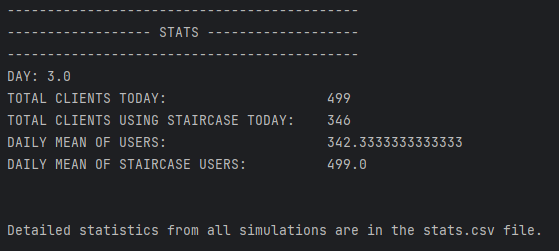

# ElevatorsSimulationHLA

## Project implementation

The project consists of 4 federates

1. BuildingFederate:

2. StaircaseFederate

3. ElevatorsFederate

4. ClientsFederate

Interactions beetwen federates (included in elevatorSimulationFOM.fed):
```

      ;;PUBLISHER: Elevator         SUBSCRIBER: Building
      (class NewElevatorRegister reliable timestamp ProjectSpace
        (parameter elevatorId)
      )

      ;;PUBLISHER: Staircase        SUBSCRIBER: Building
      (class NewStaircaseRegister reliable timestamp ProjectSpace
        (parameter staircaseId)
      )

      ;;PUBLISHER: Client           SUBSCRIBER: Building;
      (class NewClientRegister reliable timestamp ProjectSpace
        (parameter clientId)
      )

      ;;PUBLISHER: Building         SUBSCRIBER: Elevator;
      (class SendClientToDestinationFloorByElevator reliable timestamp ProjectSpace
        (parameter clientId)
        (parameter destinationFloor)
        (parameter chosenElevatorId)
      )

      ;;PUBLISHER: Building         SUBSCRIBER: Staircase;
      (class SendClientToDestinationFloorByStaircase reliable timestamp ProjectSpace
        (parameter clientId)
        (parameter destinationFloor)
      )

      ;;PUBLISHER: Elevator         SUBSCRIBER: Building;
      (class EntryDestinationFloorFromElevator reliable timestamp ProjectSpace
        (parameter clientId)
        (parameter destinationFloor)
        (parameter elevatorId)
      )

      ;;PUBLISHER: Staircase        SUBSCRIBER: Building;
      (class EntryDestinationFloorFromStaircase reliable timestamp ProjectSpace
        (parameter clientId)
        (parameter destinationFloor)
      )
```

## How to launch the application?

1. Open project in Java IDE (InteliJIdea or sth like that).

2. Find ...Federate classes, and run their methods Main. Federates are synchronized, so You don't need to launch them in any order.

3. If every of them want you to click ENTER, click ENTER in terminal of this ...Federate, which is responsible for creating the Federation.

4. It's done!

## Output
When simulation will stop (simulation time is set to 5000.0), in BuildingFederate terminal you will se following informations:



This is a sign that the program has terminated successfully. We consider one day as the completion of a single simulation. Data from all simulations is collected in the stats.csv file. Displaying the desired statistics is the result of operations on this file, contained within the runFederate method. Therefore, the average number of all clients and the average number of staircase users from all previous simulations are displayed as the average